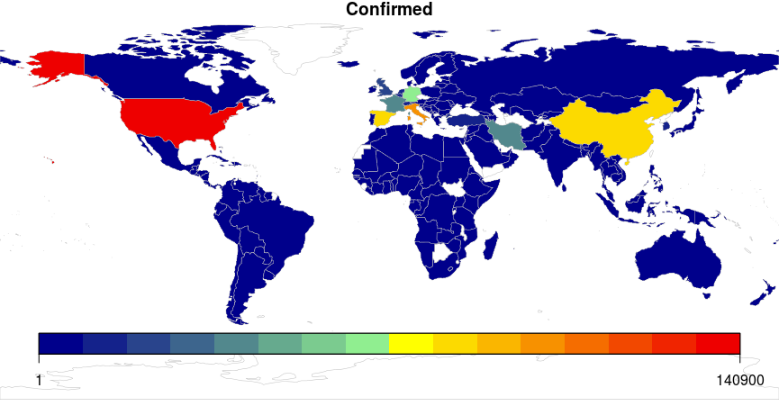

# Covid-19 Pandemic

Graphs of Covid-19 expansion for different countries.

The data is obtained from 
https://github.com/pomber/covid19
in a well suited .json format file.

One of the objectives was the development of an app with Shiny. After all, this can be seen at

http://anderson-hoff.shinyapps.io/Covid19

A gif showing the evolution in case numbers for each day was also built. I will include this gif in near future.

