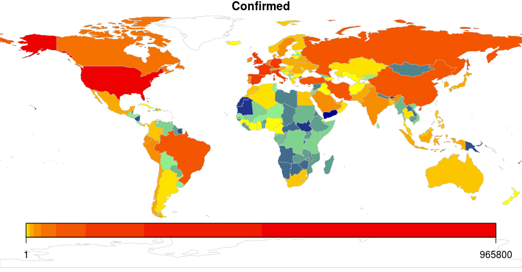

# Covid-19 Pandemic

Graphs of Covid-19 expansion for different countries.

The data is obtained from 
https://github.com/pomber/covid19
in a well suited .json format file.

One of the main objectives was the development of an app with Shiny. After all, this can be seen at

http://anderson-hoff.shinyapps.io/Covid19

All the R code to run the app can be downloaded above.

Also, I worked with the data and built a map with the number of cases for each country. 

A gif showing the evolution in case numbers for each day was also built. The R code is included as Gif_Covid19.R. The result is pretty nice, as can be seen below.

